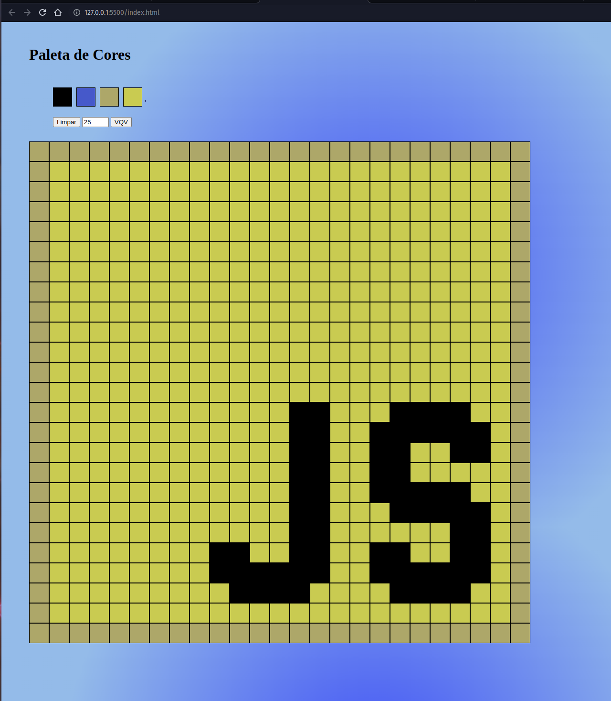

# Características do Projeto:

Entender como funciona a estrutura (HTML) de uma página;

Entender como o estilo (CSS) é aplicado à página;

Construir páginas utilizando HTML e CSS;

JavaScript;

DOM e Seletores;

Eventos;
  
  
  
 # Requisitos do projeto
 
 1 - Adicione à página o título "Paleta de Cores".

 2 - Adicione à página uma paleta de quatro cores distintas.

 3 - Adicione a cor preta como a primeira cor da paleta de cores.

 4 - Adicione à página um quadro de pixels, com 25 pixels.

 5 - Faça com que cada elemento do quadro de pixels possua 40 pixels de largura, 40 pixels de altura e seja delimitado por uma borda preta de 1 pixel.

 6 - Defina a cor preta como cor inicial. Ao carregar a página, a cor preta já deve estar selecionada para pintar os pixels

 7 - Clicar em uma das cores da paleta faz com que ela seja selecionada e utilizada para preencher os pixels no quadro.

 8 - Clicar em um pixel dentro do quadro após selecionar uma cor na paleta faz com que o pixel seja preenchido com a cor selecionada.

 9 - Crie um botão que, ao ser clicado, limpa o quadro preenchendo a cor de todos seus pixels com branco.

 10 - Faça o quadro de pixels ter seu tamanho definido pela pessoa usuária.

 11 - Limite o tamanho mínimo e máximo do board.

 12 - Faça com que as cores da paleta sejam geradas aleatoriamente ao carregar a página.
 
 ## Iniciar

Para rodar esse projeto no seu computador, abra o terminal e siga o passo-a-passo a seguir:

1. selecione no vscode o arquivo index.html
2. Inicialize o projeto com a extensão [Live Server](https://marketplace.visualstudio.com/items?itemName=ritwickdey.LiveServer) do [Visual Studio Code](https://code.visualstudio.com/) `Go Live`
3. O navegador vai abrir uma nova aba com a página do projeto 

